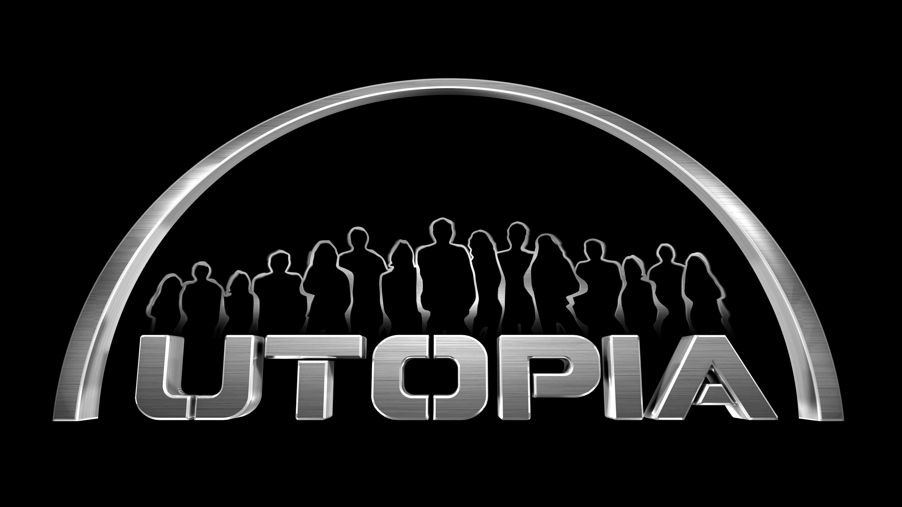
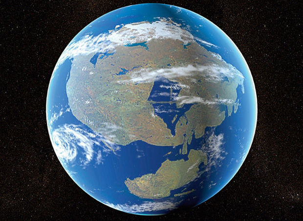

---
Geschiedenis
+++
Het is het jaar 161 [van microfoon weg] wat? ow, ok [terug in microfoon] Het is het jaar 2119
+++
Trump heeft zijn muur gebouwd (maar die is al afgebroken door de mexicanen)
+++
De effecten van de opwarming van de aarde waren erger dan we dachten
+++
Gelukkig voor ons wouw de almachtige Hendrickx(vernietiger van eeuwige ondraagbare hitte) [van microfoon weg] wat is dit script!? [terug in microfoon] de opwarming van de aarde omkeren om voor ons het perfecte klimaat te maken
+++
De mensheid heeft dan ook zijn les geleerd en is overgestapt op hernieuwbare energie
+++
Na dit alles zijn de mensen gaan geloven in
#Hendickxisme [van microfoon weg] wie heeft dit geschreven? [onhoorbaar] wie heeft dan die naam verzonnen? [terug in microfoon]
+++
Dit is het verhaal achter [van microfoon weg] hoe noemt dit ook alweer? [onhoorbaar] begrepen [in microfoon] dit is het verhaal van.
---
# Utopia II
+++

+++
Een perfecte wereld (tenminste in één persoon's perspectief)
+++
De bevolking heeft zich opgedeeld in groepen gebaseerd op hun geloof (Dus toch niet zo vershillend van vroeger)
+++
De eerste groep zijn de christenen zij blijven geloven in christus en de kerk
+++
Dan hebben we de moslims onveranderd van hun vroegere vorm
+++
De joden een kleinere groep in hun eigen provincie omdat ze niet geloven in de rest
+++
De Hendrickxers zij geloven in de almachtige Senne Hendrickx en bidden in sholen(Hendrickx was vroeger een leerkracht dus dat verklaart de sholen.)
+++
De kevuiters zij volgen Kevin en zijn tegen het Hendrickxisme
+++
En dan hebben we de atheïsten zij geloven niet in een god maar passen er toch nog bij
+++
De aarde is enorm veranderd door de opwarming (en daarna afkoeling) van de aarde.
+++
De aarde bestaat uit een supercontinent (denk maar aan de tijd wan de dinosauriërs)
+++
De wereld word gelijd door de burgers (en een paar mensen om er voor te zorgen dat alles bljft werken)
+++
criminalitiet bestaat practish niet en de mensen die dan toch de wet overtreden worden op een manier behandeld dat ze spijt hebben om wat ze hebben gedaan
+++
het meeste werk word gedaan door robots die één kopie hebben van de wetten van robotica (om te delen)
+++
het werk dat dan niet gedaan word door robots of artificiële intellgentie word dan gedaan door mensen die te veel vrije tijd hebben (iedereen dus)
+++
iedereen kan gratis eten halen in zogenaamde "supply posts" net zoals kleding  en andere levensbenodigde middelen
+++
technologie zoals computers en gsm's kunnen aangepast gemaakt worden
+++
zelfrijdende bussen die overal en altijd op tijd komen brengen mensen gratis naar hun bestemming
+++
er zijn openbare parken en sporthallen
+++
er is een vrije meninguiting zolang je een ander zijn grenzen respecteerd
en dit allemaal terwijl we onze privacy kunnen behouden
